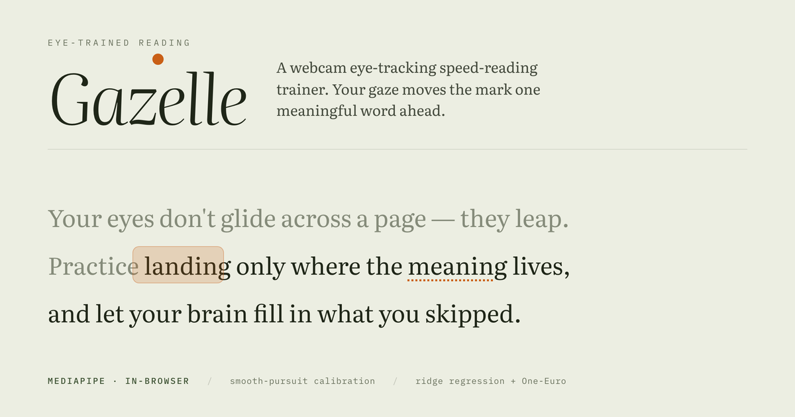
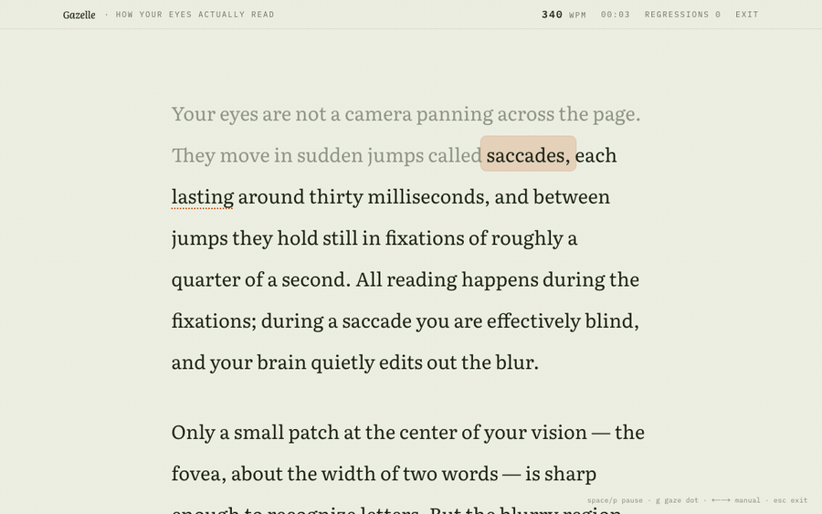
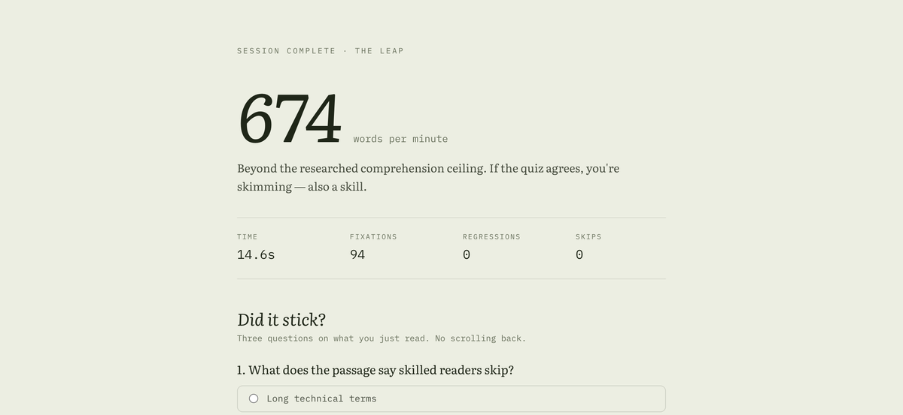

# Gazelle

*A webcam eye-tracking speed-reading trainer — your gaze moves the mark one meaningful word ahead.*

Your eyes don't glide across a page, they leap. Gazelle watches where you look and moves an
amber mark from one meaningful word to the next, training the three habits that separate fast
readers from slow ones: wide fixation spans, forward commitment (no regressions), and skipping
function words.

## Demo



That recording is the **pacer mode** — the same drill driven by a timer instead of a camera, so
it can be captured without a face on screen. Gaze mode looks identical; the difference is that
your eyes advance the mark rather than a clock. I have not recorded gaze mode, because doing it
honestly means recording my own face.

## How it works

- **Gaze tracking** — [MediaPipe Face Landmarker](https://ai.google.dev/edge/mediapipe/solutions/vision/face_landmarker)
  runs in-browser (WASM, GPU delegate with a CPU fallback) at camera frame rate. Per frame I
  extract iris positions relative to the eye corners, the eight `eyeLook*` blendshapes, and head
  pose from the facial transformation matrix (`lib/gaze/features.ts`). Nothing leaves the machine
  — there is no backend.
- **Calibration** — smooth pursuit rather than the usual nine dots: a dot glides through a
  serpentine path covering the whole screen, collecting a few hundred feature/position pairs. Eyes
  trail a moving target, so each frame is paired with where the dot was ~120 ms earlier. A second,
  shorter pass runs while you sway your head gently — without it the head-pose features have no
  variance and the model cannot separate "eyes moved" from "head moved". A ridge regression maps
  features to screen coordinates (`lib/gaze/ridge.ts`), smoothed by a One-Euro filter
  (`lib/gaze/oneEuro.ts`). Blinks are detected and dropped.
- **Drift correction** — an online offset absorbs post-calibration head drift. Every gaze-triggered
  advance nudges it gently, and pressing `space` while looking at the dotted next word applies a
  strong correction and jumps the mark there. Each step is clamped and the total offset bounded, so
  a few bad signals can't wreck the model.
- **Free look mode** — no text, just the live gaze estimate with a fading trail. The honest mirror
  for how good your calibration actually is.
- **Reading** — content words become fixation targets; stopwords are skipped, with a cap on how many
  words in a row can be dropped so the eye never has to leap too far (`lib/text.ts`). Because webcam
  gaze is only accurate to a coin-sized blur, the reader detects *arrival near the next target* using
  generous elliptical hit zones and saccade direction rather than exact fixation — and the zones widen
  in proportion to the calibration error actually measured (`components/Reader.tsx`).
- **Pacer mode** — the same drill driven by a timer at a chosen WPM, no camera needed. Time-based
  rather than a `setTimeout` chain, so the pace stays exact even when the browser throttles timers.
- **Review** — live WPM, regression and skip counts, a comprehension quiz per built-in passage, and
  session history in `localStorage`.



## Run it

```bash
npm install   # postinstall copies the MediaPipe WASM and downloads the face model into public/
npm run dev
```

Open <http://localhost:3000>, allow camera access, calibrate, read.

The `postinstall` step (`scripts/setup-assets.mjs`) needs network access once: it copies the WASM
bundle out of `node_modules` and downloads `face_landmarker.task` from the MediaPipe model zoo into
`public/models/`. Both are gitignored. It skips anything already present.

Keys while reading: `space` jump to the dotted word + retune tracking (gaze mode) ·
`p` pause · `g` toggle gaze dot · `c` recalibrate · `←/→` manual · `esc` exit.

## What it needs from the browser

- **A camera, and permission to use it**, for gaze mode and free look. Pacer mode needs neither.
- **A secure context** — `getUserMedia` only works over HTTPS or on `localhost`. Opening the dev
  server from another device on your LAN by IP will not get a camera.
- **WebGL and WASM.** MediaPipe asks for the GPU delegate first and falls back to CPU if that fails.
- I have run this in Chrome. Other browsers are untested.
- Good, even light on your face and a reasonably still head make a large difference.

## What doesn't work yet

- **Calibration is not persisted.** It lives in memory, so reloading the page means calibrating again.
- **Custom text gets no quiz.** Only the three built-in passages have comprehension questions.
- **History is thin.** Sessions are stored in `localStorage` on that one browser, and only surface on
  the results screen, from your second session onward. There is no separate history view and no export.
- **One face, front-on.** The tracker is configured for a single face and assumes you're facing the
  camera; it reports when it loses you, but it won't recover a bad calibration on its own.
- **Not deployed.** Local only for now.

## Notes on accuracy

Webcam gaze estimation is physically limited to roughly 2–4° of visual angle (~100–200 px at normal
viewing distance). Gazelle is designed around that limit rather than pretending it away: large type,
tall line spacing, wide landing zones, and a two-frame dwell before advancing. The calibration screen
reports its own RMS error so you know what you're working with — under ~85 px is sharp, under ~150 px
is workable, and above that it will tell you to redo it.
